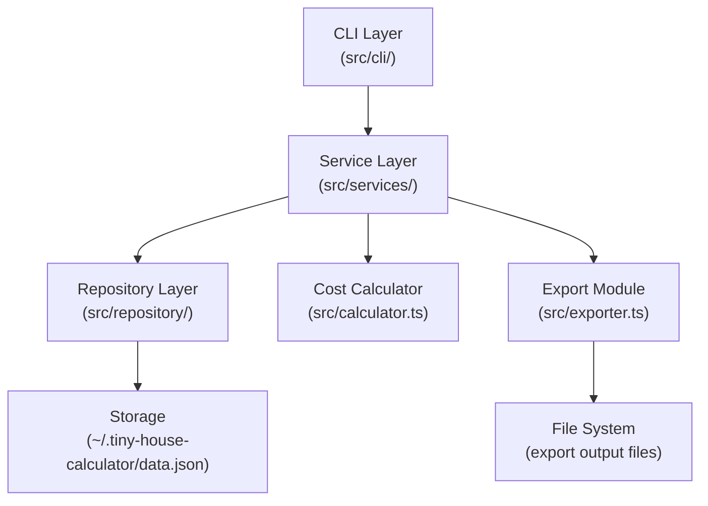

# Design Document: Tiny House Calculator

## Overview

The Tiny House Cost Calculator is a TypeScript/Node.js CLI tool that lets users manage named build projects, add and edit line items (materials, products, components), compute costs automatically, and export a bill of materials to JSON or CSV.

The tool runs entirely locally — no network calls, no cloud services. All data is persisted to a single JSON file on the user's filesystem. The architecture is a layered CLI application: a command layer parses user input, a service layer enforces business rules, a repository layer handles persistence, and utility modules handle cost math and export formatting.

**Key design decisions:**

- **Local JSON file storage** — simple, portable, no external dependencies. A single `~/.tiny-house-calculator/data.json` file holds all projects and line items.
- **Commander.js for CLI** — the most widely used, well-typed Node.js CLI framework. Handles subcommands, options, and help text cleanly.
- **csv-stringify for CSV export** — part of the mature `csv` ecosystem, actively maintained, TypeScript-native.
- **fast-check for property-based testing** — the leading PBT library for TypeScript/JavaScript, works with any test runner.
- **Decimal arithmetic via `Decimal.js`** — avoids floating-point rounding errors for financial calculations (e.g., `0.1 + 0.2 !== 0.3`).

---

## Architecture



### Data Flow

1. User invokes a CLI command (e.g., `thc project create "My Build"`)
2. Commander.js parses arguments and delegates to the appropriate command handler in `src/cli/`
3. The command handler calls the relevant service method (e.g., `ProjectService.create()`)
4. The service validates inputs, applies business rules, and calls the repository
5. The repository reads/writes `data.json` atomically
6. Results are returned up the chain and formatted for terminal output by the CLI layer

### Atomic Writes

To prevent data corruption on write failures, the repository writes to a temporary file first, then renames it to the target path. On POSIX systems, `fs.rename` is atomic.

---

## Components and Interfaces

### CLI Layer (`src/cli/`)

| File | Responsibility |
|---|---|
| `src/index.ts` | Entry point; registers all subcommands with Commander |
| `src/cli/project.ts` | `project create`, `project list`, `project get`, `project delete` commands |
| `src/cli/item.ts` | `item add`, `item update`, `item remove`, `item list` commands |
| `src/cli/bom.ts` | `bom view` command |
| `src/cli/export.ts` | `export json`, `export csv` commands |
| `src/cli/formatter.ts` | Terminal output formatting (tables, error messages) |

### Service Layer (`src/services/`)

| File | Responsibility |
|---|---|
| `src/services/ProjectService.ts` | Project CRUD, name uniqueness enforcement |
| `src/services/LineItemService.ts` | Line item CRUD, validation, cost recomputation trigger |
| `src/services/BomService.ts` | Assembles BillOfMaterials from project data |

### Supporting Modules

| File | Responsibility |
|---|---|
| `src/repository/FileRepository.ts` | Read/write `data.json`; atomic write via temp file + rename |
| `src/calculator.ts` | `computeTotalCost`, `computeGrandTotal`, `computeCategorySubtotals` |
| `src/exporter.ts` | `exportJson`, `exportCsv` — serializes BOM to file |
| `src/validator.ts` | All input validation functions |
| `src/types.ts` | All TypeScript interfaces and type definitions |
| `src/errors.ts` | Custom error classes |
| `src/constants.ts` | Valid categories list, field limits |

---

## Data Models

### TypeScript Interfaces

```typescript
// src/types.ts

export type CategoryName =
  | 'Foundation'
  | 'Framing'
  | 'Roofing'
  | 'Electrical'
  | 'Plumbing'
  | 'Insulation'
  | 'Interior'
  | 'Exterior'
  | 'Windows & Doors'
  | 'Appliances'
  | 'Miscellaneous';

export interface Project {
  id: string;           // UUID v4
  name: string;         // 1–100 chars, trimmed
  description: string;  // 0–500 chars, trimmed; empty string if not provided
  createdAt: string;    // ISO 8601 timestamp
  lineItems: LineItem[];
}

export interface LineItem {
  id: string;           // UUID v4, unique within project
  name: string;         // 1–100 chars, trimmed
  category: CategoryName;
  quantity: number;     // 0.01–999,999.99
  unit: string;         // 1–50 chars, trimmed (e.g., "board", "sheet", "each")
  unitCost: number;     // 0.00–999,999,999.99
  totalCost: number;    // computed: quantity * unitCost, rounded half-up to 2dp
  notes: string;        // 0–500 chars, trimmed; empty string if not provided
}

export interface BillOfMaterials {
  projectName: string;
  description: string;
  generatedDate: string;          // ISO 8601 date: YYYY-MM-DD
  categories: CategorySection[];
  grandTotal: number;             // sum of all category subtotals, rounded half-up to 2dp
}

export interface CategorySection {
  category: CategoryName;
  lineItems: LineItem[];
  subtotal: number;               // sum of totalCost for items in this category
}

// Persisted store — the shape of data.json
export interface DataStore {
  version: number;      // schema version for future migrations
  projects: Project[];
}

// Result type for service operations
export type Result<T> =
  | { success: true; data: T }
  | { success: false; error: string };
```

### Storage Schema

`~/.tiny-house-calculator/data.json`:

```json
{
  "version": 1,
  "projects": [
    {
      "id": "uuid-v4",
      "name": "My First Build",
      "description": "A 200 sq ft loft build",
      "createdAt": "2025-01-15T10:30:00.000Z",
      "lineItems": [
        {
          "id": "uuid-v4",
          "name": "2x6 Lumber",
          "category": "Framing",
          "quantity": 40,
          "unit": "board",
          "unitCost": 8.50,
          "totalCost": 340.00,
          "notes": "16ft lengths"
        }
      ]
    }
  ]
}
```

### Cost Arithmetic

All monetary calculations use `Decimal.js` to avoid IEEE 754 floating-point errors:

```typescript
// src/calculator.ts (conceptual)
import Decimal from 'decimal.js';

Decimal.set({ rounding: Decimal.ROUND_HALF_UP });

export function computeTotalCost(quantity: number, unitCost: number): number {
  return new Decimal(quantity).mul(unitCost).toDecimalPlaces(2).toNumber();
}

export function computeGrandTotal(lineItems: LineItem[]): number {
  return lineItems
    .reduce((sum, item) => sum.plus(item.totalCost), new Decimal(0))
    .toDecimalPlaces(2)
    .toNumber();
}
```

---

## CLI Interface Design

The CLI binary is `thc` (tiny house calculator). All commands follow the pattern:

```
thc <resource> <action> [arguments] [options]
```

### Project Commands

```
thc project create <name> [--description <text>]
thc project list
thc project get <name>
thc project delete <name>
```

### Line Item Commands

```
thc item add <project-name> --name <text> --category <cat> --quantity <n> --unit <text> --unit-cost <n> [--notes <text>]
thc item update <project-name> <item-id> [--name <text>] [--category <cat>] [--quantity <n>] [--unit <text>] [--unit-cost <n>] [--notes <text>]
thc item remove <project-name> <item-id>
thc item list <project-name> [--category <cat>]
```

### Bill of Materials

```
thc bom view <project-name>
```

### Export

```
thc export json <project-name> [--output <filepath>]
thc export csv <project-name> [--output <filepath>]
```

Default output paths when `--output` is omitted:
- JSON: `./<project-name>-bom.json`
- CSV: `./<project-name>-bom.csv`

### Example Session

```bash
$ thc project create "Mountain Cabin" --description "Off-grid 180 sq ft build"
✓ Project "Mountain Cabin" created.

$ thc item add "Mountain Cabin" \
    --name "2x6 Lumber" \
    --category Framing \
    --quantity 40 \
    --unit board \
    --unit-cost 8.50
✓ Line item added (id: a1b2c3d4).

$ thc bom view "Mountain Cabin"
Project: Mountain Cabin
Description: Off-grid 180 sq ft build
Generated: 2025-07-01

FRAMING
  2x6 Lumber    40 board @ $8.50    $340.00
  Subtotal:                         $340.00

GRAND TOTAL:                        $340.00

$ thc export csv "Mountain Cabin"
✓ Exported to ./Mountain Cabin-bom.csv
```

---

## Storage Strategy

### Location

Data is stored at `~/.tiny-house-calculator/data.json`. The directory is created on first run if it does not exist.

### Read Strategy

The entire `data.json` file is read into memory on each command invocation. For a local tool managing a single tiny house build, the data volume is small (hundreds of line items at most) and in-memory operation is appropriate.

### Write Strategy

Writes use an atomic pattern to prevent corruption:

1. Serialize the updated `DataStore` to JSON (pretty-printed, 2-space indent)
2. Write to a temp file: `~/.tiny-house-calculator/data.json.tmp`
3. `fs.rename(tmpPath, dataPath)` — atomic on POSIX; near-atomic on Windows

### Schema Versioning

The `version` field in `DataStore` allows future migrations. On read, if `version` is missing or lower than the current version, a migration function upgrades the data in memory before use.

---

## Export Implementation

### JSON Export

The JSON export serializes the full `BillOfMaterials` object:

```typescript
// src/exporter.ts
export async function exportJson(bom: BillOfMaterials, outputPath: string): Promise<void> {
  const json = JSON.stringify(bom, null, 2);
  await writeAtomic(outputPath, json);
}
```

The exported JSON structure mirrors the `BillOfMaterials` interface exactly, making round-trip import straightforward.

### CSV Export

The CSV export uses `csv-stringify` (from the `csv` package ecosystem) to produce one row per line item:

```
category,name,quantity,unit,unit cost,total cost,notes
Framing,2x6 Lumber,40,board,8.50,340.00,16ft lengths
```

```typescript
import { stringify } from 'csv-stringify/sync';

export async function exportCsv(bom: BillOfMaterials, outputPath: string): Promise<void> {
  const rows = bom.categories.flatMap(section =>
    section.lineItems.map(item => [
      item.category,
      item.name,
      item.quantity,
      item.unit,
      item.unitCost,
      item.totalCost,
      item.notes,
    ])
  );
  const csv = stringify(rows, {
    header: true,
    columns: ['category', 'name', 'quantity', 'unit', 'unit cost', 'total cost', 'notes'],
  });
  await writeAtomic(outputPath, csv);
}
```

### Atomic File Write Helper

Both exporters use a shared `writeAtomic` helper that writes to a `.tmp` file first, then renames, to avoid leaving partial files on failure.

---

## Correctness Properties

*A property is a characteristic or behavior that should hold true across all valid executions of a system — essentially, a formal statement about what the system should do. Properties serve as the bridge between human-readable specifications and machine-verifiable correctness guarantees.*

### Property 1: TotalCost is always quantity × unitCost rounded half-up to 2 decimal places

*For any* valid quantity (0.01–999,999.99) and valid unit cost (0.00–999,999,999.99), the computed `totalCost` SHALL equal `round_half_up(quantity × unitCost, 2)`.

**Validates: Requirements 3.1**

---

### Property 2: GrandTotal equals the sum of all line item TotalCosts

*For any* project containing any number of line items with valid quantities and unit costs, the `grandTotal` SHALL equal the sum of all individual `totalCost` values, rounded half-up to 2 decimal places.

**Validates: Requirements 3.2, 3.4**

---

### Property 3: Category subtotals are consistent with line item TotalCosts

*For any* project, the subtotal for each category SHALL equal the sum of `totalCost` for all line items assigned to that category, and the sum of all category subtotals SHALL equal the `grandTotal`.

**Validates: Requirements 3.3**

---

### Property 4: JSON export round-trip preserves all data

*For any* project with any number of valid line items, exporting to JSON and then parsing the resulting JSON SHALL produce a `BillOfMaterials` with identical line item count, identical field values for each line item, identical category subtotals, and an identical `grandTotal`.

**Validates: Requirements 5.3**

---

### Property 5: Whitespace-only project names are always rejected

*For any* string composed entirely of whitespace characters (spaces, tabs, newlines), attempting to create a project with that name SHALL be rejected with a descriptive error, and no project SHALL be created.

**Validates: Requirements 1.3, 6.2**

---

### Property 6: Whitespace-only line item names are always rejected

*For any* string composed entirely of whitespace characters, attempting to add or update a line item with that name SHALL be rejected with a descriptive error, and the line item state SHALL remain unchanged.

**Validates: Requirements 6.1**

---

### Property 7: Input trimming is applied before validation

*For any* string input with leading or trailing whitespace, the trimmed value SHALL be used for both validation and storage, such that a name of `"  My Build  "` is stored as `"My Build"`.

**Validates: Requirements 6.8**

---

### Property 8: Invalid category values are always rejected

*For any* string that is not in the defined `CategoryName` union, attempting to add or update a line item with that category SHALL be rejected with a descriptive error listing all valid categories.

**Validates: Requirements 6.7**

---

### Property 9: Quantity out of range is always rejected

*For any* numeric value outside the range 0.01–999,999.99, attempting to use it as a quantity SHALL be rejected with a descriptive error identifying the quantity field and the allowed range.

**Validates: Requirements 2.3, 6.4**

---

### Property 10: Unit cost out of range is always rejected

*For any* numeric value outside the range 0.00–999,999,999.99, attempting to use it as a unit cost SHALL be rejected with a descriptive error identifying the unit cost field and the allowed range.

**Validates: Requirements 2.4, 6.6**

---

## Error Handling

### Custom Error Classes (`src/errors.ts`)

```typescript
export class ValidationError extends Error {
  constructor(public readonly field: string, message: string) {
    super(message);
    this.name = 'ValidationError';
  }
}

export class NotFoundError extends Error {
  constructor(public readonly resource: string, public readonly identifier: string) {
    super(`${resource} not found: "${identifier}"`);
    this.name = 'NotFoundError';
  }
}

export class ConflictError extends Error {
  constructor(public readonly field: string, public readonly value: string) {
    super(`${field} already exists: "${value}"`);
    this.name = 'ConflictError';
  }
}

export class StorageError extends Error {
  constructor(message: string, public readonly cause?: unknown) {
    super(message);
    this.name = 'StorageError';
  }
}

export class ExportError extends Error {
  constructor(message: string, public readonly cause?: unknown) {
    super(message);
    this.name = 'ExportError';
  }
}
```

### Error Handling Strategy

- **Service layer** throws typed errors (`ValidationError`, `NotFoundError`, etc.)
- **CLI layer** catches all errors and formats them for terminal output — never exposes stack traces to the user
- **Repository layer** wraps `fs` errors in `StorageError`
- **Export module** wraps file system and serialization errors in `ExportError` and cleans up any partial files before re-throwing
- **Result type** (`Result<T>`) is used for service return values to make success/failure explicit at call sites

### Error Message Format

All user-facing error messages follow the pattern:

```
✗ Error: <descriptive message>
```

Example:
```
✗ Error: Project name is invalid — name cannot be empty or whitespace-only.
✗ Error: Project not found: "My Build"
✗ Error: quantity must be between 0.01 and 999,999.99 (got: -5)
✗ Error: Invalid category "Garage". Valid categories: Foundation, Framing, Roofing, Electrical, Plumbing, Insulation, Interior, Exterior, Windows & Doors, Appliances, Miscellaneous
```

---

## Testing Strategy

### Framework

- **Test runner**: Vitest (fast, TypeScript-native, no config overhead)
- **Property-based testing**: `fast-check` (works natively with Vitest)
- **Minimum iterations per property test**: 100

### Test File Organization

Tests live alongside source in a `__tests__` directory per module:

```
src/
  calculator.ts
  validator.ts
  services/
    ProjectService.ts
    LineItemService.ts
    BomService.ts
  repository/
    FileRepository.ts
  exporter.ts
  __tests__/
    calculator.test.ts        ← property tests for cost math
    validator.test.ts         ← property tests for input validation
    ProjectService.test.ts    ← unit + property tests
    LineItemService.test.ts   ← unit + property tests
    BomService.test.ts        ← unit tests
    exporter.test.ts          ← property test for JSON round-trip
    FileRepository.test.ts    ← unit tests (mocked fs)
```

### Dual Testing Approach

**Unit tests** cover:
- Specific examples demonstrating correct behavior
- Integration points between components (service → repository)
- Edge cases: empty project, zero-item BOM, duplicate project names

**Property tests** cover the 10 correctness properties above, each tagged with:

```typescript
// Feature: tiny-house-calculator, Property 1: TotalCost is always quantity × unitCost rounded half-up to 2dp
```

### Property Test Examples

```typescript
// calculator.test.ts
import { describe, it } from 'vitest';
import * as fc from 'fast-check';
import { computeTotalCost, computeGrandTotal } from '../calculator';

describe('computeTotalCost', () => {
  it('Property 1: totalCost equals quantity × unitCost rounded half-up to 2dp', () => {
    // Feature: tiny-house-calculator, Property 1: TotalCost is always quantity × unitCost rounded half-up to 2dp
    fc.assert(
      fc.property(
        fc.float({ min: 0.01, max: 999_999.99, noNaN: true }),
        fc.float({ min: 0.00, max: 999_999_999.99, noNaN: true }),
        (quantity, unitCost) => {
          const result = computeTotalCost(quantity, unitCost);
          // Result must be a finite number with at most 2 decimal places
          expect(Number.isFinite(result)).toBe(true);
          expect(result).toBeGreaterThanOrEqual(0);
          expect(Math.round(result * 100) / 100).toBe(result);
        }
      ),
      { numRuns: 100 }
    );
  });
});
```

### What PBT Is NOT Used For

- Repository file I/O (tested with mocked `fs`, example-based)
- CLI argument parsing (example-based, tests Commander integration)
- Terminal output formatting (example-based snapshot tests)
- Project/line item CRUD happy paths (example-based unit tests)

These are either infrastructure wiring, UI rendering, or deterministic single-path behaviors where 100 iterations add no value over 2–3 examples.
